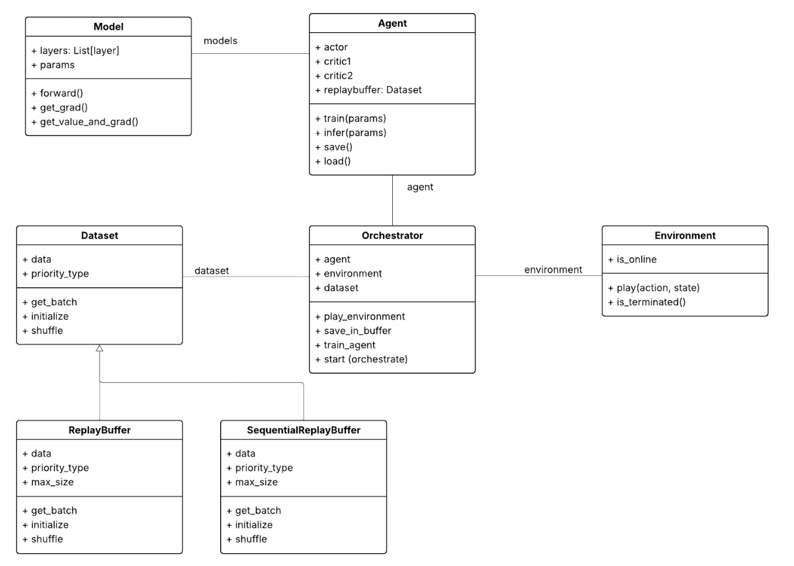
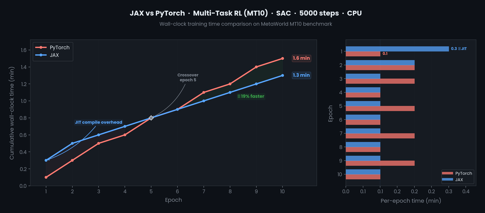

## Geodesic: Open-source Reinforcement Learning Framework 
Geodesic: shortest path to deployment for reinforcement learning 

Applications: Robotics, VLA, LLM Post-training, RL research 

## Setup

Install [uv](https://docs.astral.sh/uv/) if you don't have it:
```bash
curl -LsSf https://astral.sh/uv/install.sh | sh
```

Clone the repo and install dependencies:
```bash
git clone https://github.com/wzoustanford/geodesic.git 
cd geodesic
uv venv --python 3.12
source .venv/bin/activate
uv sync
```

Python 3.12 is required — mujoco and metaworld do not yet have wheels for newer versions. 

## Online RL 
python -m tests.ut_online_rl_metaworld_mt10

## Offline RL 
python -m tests.ut_offline_rl 

random sample data: offline_rl_random_sample_data.csv
works with offline trajetories to be split into train/val/test sets 

## Algorithms 
- DQN (Q-learning)
- SAC (Soft Actor Critic)

## Action spaces  
- Binary (QL)
- Discrete/multinomial (QL)
- Continous (SAC) 

## JAX 
- Multi-task RL on metaworld
- MTSAC 

JAX speed-up 


## RLDataset Schema 

| Field | Type | Shape | Description |
|---|---|---|---|
| `states` | `np.ndarray` | `(N, S)` | Normalized observed states for each transition |
| `actions` | `np.ndarray` | `(N, A)` | Actions taken at each transition |
| `rewards` | `np.ndarray` | `(N,)` | Scalar reward received after each transition |
| `next_states` | `np.ndarray` | `(N, S)` | Normalized successor states after each transition |
| `dones` | `np.ndarray` | `(N,)` | Episode termination flags (`True` if terminal) |
| `n_transitions` | `int` | `—` | Total number of transitions `N` across all trajectories |
| `n_trajs` | `int` | `—` | Total number of trajectories collected |
| `state_features` | `list[str]` | `(S,)` | Ordered list of feature names corresponding to state dimensions |

> **Shape key:** `N` = number of transitions, `S` = state dimension, `A` = action dimension.

## Contributions
We are looking for core developers, reachout to will@angle.ac, jennifer@angle.ac 

