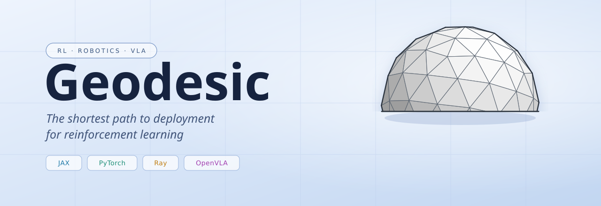
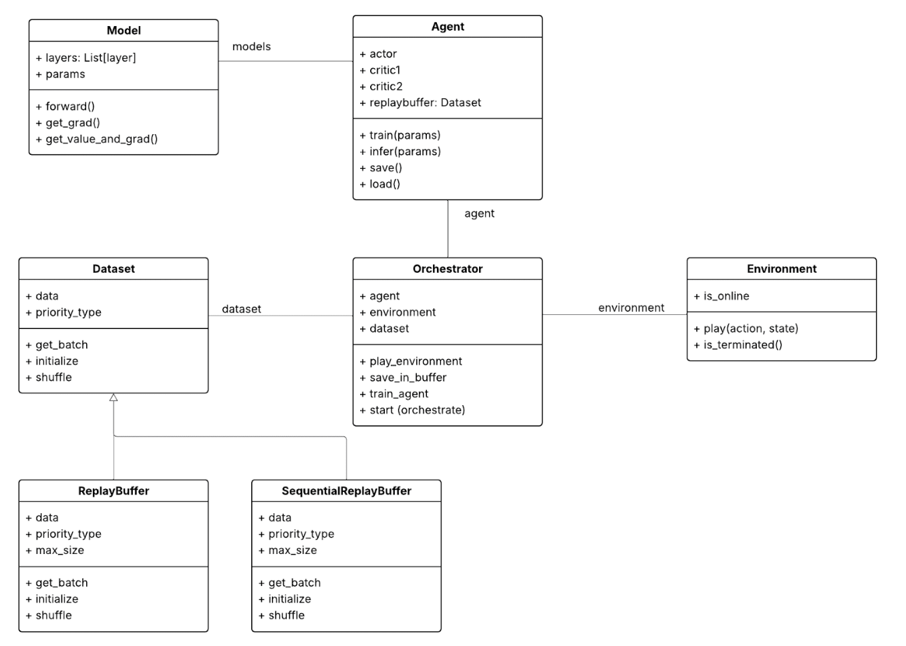
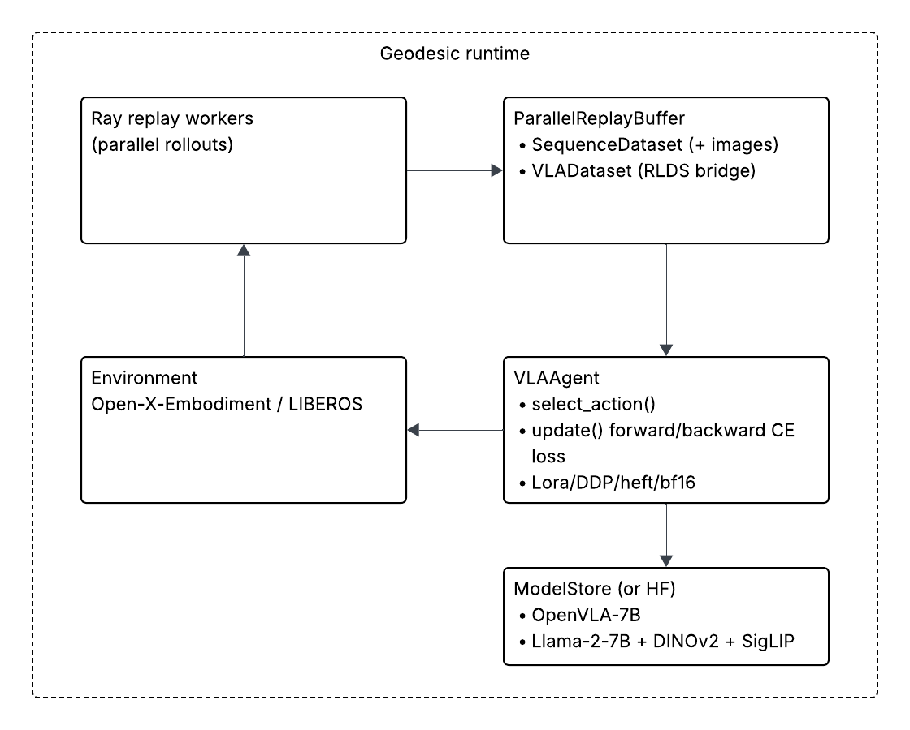
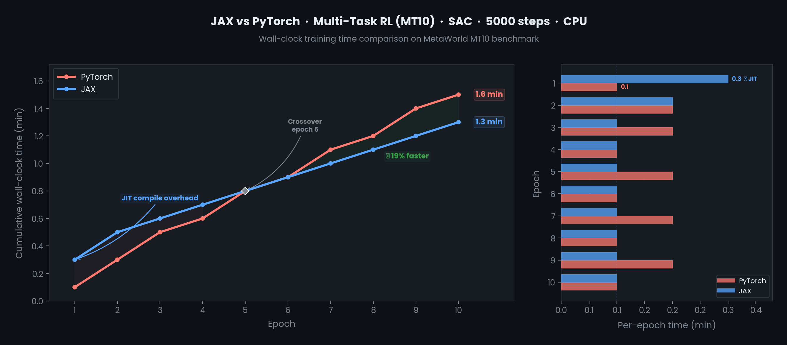

<p align="center">
  
</p>

<p align="center">
  <b>An open-source robotics and reinforcement-learning-native framework — the shortest path to deployment.</b><br>
  One agent/environment/dataset contract, two numerical backends (JAX + PyTorch), distributed by default with Ray.
</p>

<p align="center">
  <a href="https://github.com/wzoustanford/geodesic/blob/main/LICENSE"></a>
  
  
  
  
  
</p>

<p align="center">
  <b>Applications:</b> Robotics&nbsp;·&nbsp;Vision-Language-Action (VLA)&nbsp;·&nbsp;LLM post-training&nbsp;·&nbsp;RL research
</p>

---

## Why Geodesic?

Geodesic is built around abstractions that are stable components of a scalable reinforcement learning system. Rather than built around a training loop, Geodesic formalizes the orchestration, agent, model, environment and replay dataset components. This makes it simple to build algorithms with multiple models (actor, advantage, critic, reward), strengthen them with backends (Jax, torch inductor, triton), and scale with distributed systems (Ray, streaming data, DDP/FSDP). 

- **Dual backend, one interface.** `SACAgent` (PyTorch) and `JAXSACAgent` (JAX/Flax/Optax) implement the same `Agent` abstraction. The JAX path inherits directly from the PyTorch agent and overrides only the numerical core, so the orchestrator, dataset, and environment code are shared.
- **Distributed by design.** Experience collection runs in parallel `Ray` actors that push transitions through a `Ray Queue` into a replay buffer, while training stays centralized on the learner. Data-collection throughput scales independently of training compute.
- **Robotics + foundation models in the same stack.** Classic control and offline RL live next to OpenVLA-7B fine-tuning on LIBERO, behind one orchestrator pattern.
- **Layered abstractions.** A single base class per subsystem (`Agent`, environment config, dataset) with concrete implementations that are free to vary. Public interfaces are stable; internals are swappable.
- **Reproducible & lightweight to start.** [`uv`](https://docs.astral.sh/uv/)-managed environment, deterministic CI, and a fast unit-test suite that runs without a GPU.

```python
# The whole loop, regardless of backend:
agent = JAXSACAgent(state_dim=59, action_dim=4)      # or SACAgent(...) for PyTorch
orc   = Orchestrator(agent, data_config, num_epochs=10,
                     env_config=MetaworldConfig(env_id="MT10"),
                     warmstart_steps=100)
orc.start_online()
```

---

## Highlights

| Capability | What you get |
|---|---|
| **Algorithms** | DQN / double-Q (binary & multinomial-discrete action spaces), SAC (continuous), multi-task SAC, OpenVLA imitation learning |
| **Backends** | PyTorch and JAX (`@jax.jit`, `optax`, `flax`, `distrax`), selectable per agent |
| **Distributed** | Ray actors for parallel rollout, a shared replay buffer with a background drain thread, and a `ModelSharedStorage` parameter server |
| **Environments** | MetaWorld MT10/MT25/MT50 and meta-RL (ML1/ML10/ML45); LIBERO via RLDS for VLA; Atari integration in progress |
| **Datasets** | Sequence replay with windowing/stride, offline train/val/test splits, prioritized-replay sum-tree (WIP), pluggable model- and rule-based rewards |
| **Foundation models** | OpenVLA-7B fine-tuning (LoRA + bf16) wired into the same `Agent`/`Orchestrator` contract |

---

## Architecture at a glance

<p align="center">
  
</p>

Three subsystems, coordinated by an orchestrator:

- **`Agent`** — `select_actions()`, `update()`, `save()` / `load()`. The Q-learning family shares a double-Q base (`BaseQLAgent → DiscreteQLAgent → {BinaryActionQLAgent, MultinomialActionQLAgent}`); `SACAgent` adds an actor and learnable temperature; `JAXSACAgent` re-implements the numerical core in JAX while reusing everything else.
- **Environment** — a frozen-dataclass config (`MetaworldConfig`, …) acts as a factory that `spawn()`s vectorized gym environments and declares observation/action spaces.
- **Dataset** — `SequenceDataset` stores fixed-length windows; `OfflineRLDataCollection` builds train/val/test splits from trajectory CSVs; `ParallelReplayBuffer` drains a Ray queue into local sequence storage; everything is consumed through a PyTorch `DataLoader`.
- **`Orchestrator`** — drives the collect → store → sample → train loop, handles validation/checkpointing, and (in `ParallelReplayOrchestrator`) launches and syncs distributed workers.

For the full distributed runtime design, see [`mds/ray_jax_runtime.md`](mds/ray_jax_runtime.md).

---

## Quickstart

Install [`uv`](https://docs.astral.sh/uv/) if you don't have it:

```bash
curl -LsSf https://astral.sh/uv/install.sh | sh
```

Clone and set up the environment:

```bash
git clone https://github.com/wzoustanford/geodesic.git
cd geodesic
uv venv --python 3.12
source .venv/bin/activate
uv sync
```

> **Python 3.12 is required** — `mujoco` and `metaworld` do not yet publish wheels for newer versions.

Run the lightweight unit tests (no GPU needed):

```bash
uv run --with pytest pytest -q tests/test_*.py
```

The `test_*.py` suite covers Vaso reward logic, `SequenceDataset` windowing and batch shapes, and multinomial action discretization. The `tests/ut_*` files are longer end-to-end smoke scripts (run individually, below) and are intentionally **not** part of the default unit suite.

---

## Examples

### Online RL — SAC on MetaWorld MT10

```bash
# PyTorch backend
python -m tests.ut_online_rl_metaworld_mt10

# JAX backend (JIT-compiled SAC update)
python -m tests.ut_online_rl_metaworld_mt10_jax
```

### Parallel experience replay (Ray)

```bash
# Multiple Ray rollout workers feed a shared replay buffer; learner trains centrally
python -m tests.ut_parallel_replay_metaworld_mt10_jax
```

### Offline RL

```bash
python -m tests.ut_offline_rl
```

Works from offline trajectories (`offline_rl_random_sample_data.csv`) split into train/val/test sets, with manual or model-based rewards configured via the files in `configs/`.

### Vision-Language-Action (OpenVLA-7B)

```bash
# Fixture-based forward/backward smoke test (parses anywhere; runs e2e on GPU + HF_TOKEN)
python -m tests.ut_vla

# Real LIBERO RLDS pipeline end-to-end (GPU + HF_TOKEN + LIBERO shards)
python -m tests.ut_vla_rlds
```

OpenVLA is treated as a sibling repo on `PYTHONPATH` rather than a hard dependency (its pins conflict with Geodesic's). See [`mds/vla_v1_with_openvla_dep_remote_setup.md`](mds/vla_v1_with_openvla_dep_remote_setup.md) for the clean-machine GPU setup, and [`mds/ray_jax_runtime.md`](mds/ray_jax_runtime.md) for the runtime architecture.

<p align="center">
  
</p>

---

## Support matrix

| Algorithm | Backend(s) | Action space | Status |
|---|---|---|---|
| DQN / double-Q | PyTorch | Binary | ✅ |
| DQN / double-Q | PyTorch | Discrete / multinomial | ✅ |
| SAC | PyTorch, JAX | Continuous | ✅ |
| Multi-task SAC (MTSAC) | JAX (`vmap` over tasks) | Continuous | ✅ |
| OpenVLA (imitation) | PyTorch (LoRA + bf16) | 7-DoF EEF embodiment | ✅ |
| DQN (EfficientZero-style Atari) | JAX | Discrete | 🔭 in progress |

**Embodiments / data:** OXE, LIBERO (RLDS). **Environments:** MetaWorld MT10/MT25/MT50, meta-RL ML1/ML10/ML45.

---

## Benchmarks — JAX vs PyTorch

SAC on MetaWorld MT10 (10-task multi-task robotics), measured **CPU-only** on a MacBook Pro (see [`mds/jax_speedup.md`](mds/jax_speedup.md)):

<p align="center">
  
</p>

- **~19% lower wall-clock** end-to-end (JAX 1.3 min vs PyTorch 1.6 min over 10 epochs / 5000 steps).
- **JIT warmup is a one-time cost** — JAX's first epoch is ~3× slower (XLA tracing), then runs ~2× faster per epoch at steady state; cumulative time crosses over by epoch 5.
- The gap is **expected to widen on GPU** with larger batches, where XLA kernel fusion and vectorized env parallelism have more room to exploit hardware.

> Numbers reflect a small CPU smoke configuration and are meant to illustrate the JIT/steady-state trade-off, not to be a maximal-throughput benchmark.

---

## What makes the JAX path fast

The JAX backend compiles the full SAC update — critic, actor, temperature, and soft target update — into a single XLA program:

- `@jax.jit` on the end-to-end update and on action sampling
- `optax` optimizer chains with immutable `TrainState` / `CriticTrainState` pytrees threaded through JIT
- `distrax` for tanh-squashed Gaussian policies with exact log-prob correction inside the graph
- `jax.vmap` for per-task critic/actor losses and `jax.tree.map` for gradient averaging across tasks
- explicit `PRNGKey` management replacing PyTorch's global RNG

The PyTorch→JAX mapping is documented item-by-item in [`mds/jax_structure.md`](mds/jax_structure.md).

---

## Dataset schema

The canonical transition schema consumed by the offline pipeline and replay buffers:

| Field | Type | Dimensions | Description |
|---|---|---|---|
| `states` | `np.ndarray` | `(N, S)` | Normalized observed states for each transition |
| `actions` | `np.ndarray` | `(N, A)` | Actions taken at each transition |
| `rewards` | `np.ndarray` | `(N,)` | Scalar reward received after each transition |
| `next_states` | `np.ndarray` | `(N, S)` | Normalized successor states after each transition |
| `dones` | `np.ndarray` | `(N,)` | Episode termination flags (`True` if terminal) |
| `n_transitions` | `int` | `—` | Total number of transitions `N` across all trajectories |
| `n_trajs` | `int` | `—` | Total number of trajectories collected |
| `state_features` | `list[str]` | `(S,)` | Ordered list of feature names for state dimensions |

> **Shape key:** `N` = transitions, `S` = state dimension, `A` = action dimension.

A VLA-specific schema (images, language instructions, action chunks, dataset provenance) extends this for the RLDS path — see [`mds/ray_jax_runtime.md`](mds/ray_jax_runtime.md#data-contracts).

---

## Project layout

```
geodesic/
├── agents.py            # Agent ABC, BaseQLAgent → Discrete/Binary/Multinomial QL, SACAgent
├── jax_agents.py        # JAXSACAgent: JIT-compiled SAC, inherits the PyTorch contract
├── models.py            # PyTorch Q-networks + ModelSharedStorage (Ray param server)
├── jax_models.py        # Flax modules: actor, critic ensemble, temperature
├── datasets.py          # Sequence/Transition datasets, ParallelReplayBuffer, offline pipeline
├── orchestrator.py      # Orchestrator, ParallelReplayOrchestrator, DataWorker (Ray actor)
├── vla_agent.py         # OpenVLAAgent (LoRA + bf16 imitation learning)
├── vla_models.py        # OpenVLA-7B wrappers (vision, projector, language, policy)
├── vla_datasets.py      # RLDS transform/dataset + padded collator + synthetic fixtures
├── vla_orchestrator.py  # Supervised IL orchestrator for VLA agents
├── envs/                # MetaWorld configs (MT/ML), gym vectorized env factories
├── configs/             # Data + feature configs (offline RL, VLA/LIBERO)
├── projects/            # Domain projects (e.g. vaso clinical reward logic)
├── tests/               # test_*.py unit suite + ut_*.py e2e smoke scripts
└── mds/                 # Design docs: JAX plan, Ray+JAX runtime, OpenVLA, Atari
```

---

## Roadmap

- **Streaming infrastructure** — a Kafka-like backbone for online RL, online learning, and episodic memory in real-time robotics.
- **Prioritized replay** — promote the sum-tree `PrioritySampler` from sketch to a tested, production prioritized-replay path.
- **Atari / EfficientZero** — DQN on Atari via a dedicated env stack and parallel replay (see [`mds/atari_env_efficient_zero_investigation.md`](mds/atari_env_efficient_zero_investigation.md)).
- **LLM/VLA post-training** — GRPO/PPO post-training, replay-buffer construction, and contextual inference management.
- **Training/serving optimizations** — RAM-efficient large-model training (PyTorch FSDP and related techniques).
- **Test coverage** — offline data prep, orchestrator metrics, checkpoint save/load, Ray replay lifecycle, MetaWorld/JAX smoke, and VLA wrappers.

---

## Contributing

We're looking for core developers. If the roadmap above resonates — distributed RL runtimes, JAX numerics, or VLA/robotics foundation models — we'd love to hear from you.

- **Reach out:** [will@angle.ac](mailto:will@angle.ac)
- **Pick up a workstream:** each roadmap item above is designed as an incremental, self-contained extension to the existing architecture.
- **Before a PR:** run `uv run --with pytest pytest -q tests/test_*.py` and make sure new public interfaces come with tests.

---

## Citation

If you use Geodesic in your research, please cite the repository:

```bibtex
@software{geodesic_2026,
  title  = {Geodesic: An Open-Source Reinforcement Learning Framework for Robotics, VLA, and LLM Post-Training},
  author = {AngleNexus},
  year   = {2026},
  url    = {https://github.com/wzoustanford/geodesic}
}
```

## License

Apache License 2.0 — see [`LICENSE`](LICENSE). © 2026 AngleNexus.

---

## Changelog

- **May 13, 2026** — OpenVLA-7B training/fine-tuning from LIBERO is supported ([PR12](https://github.com/wzoustanford/geodesic/pull/12)).
- **Apr 20, 2026** — Ray integration: parallel experience replay via distributed tasks ([PR11](https://github.com/wzoustanford/geodesic/pull/11)).
- **Apr 16, 2026** — JAX backend: SAC on MetaWorld ([PR9](https://github.com/wzoustanford/geodesic/pull/9)).
